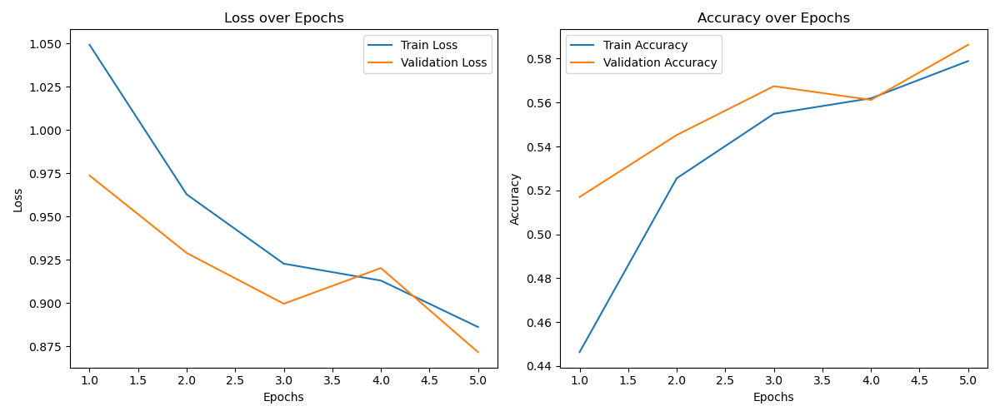
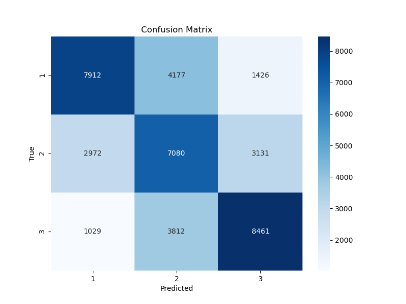
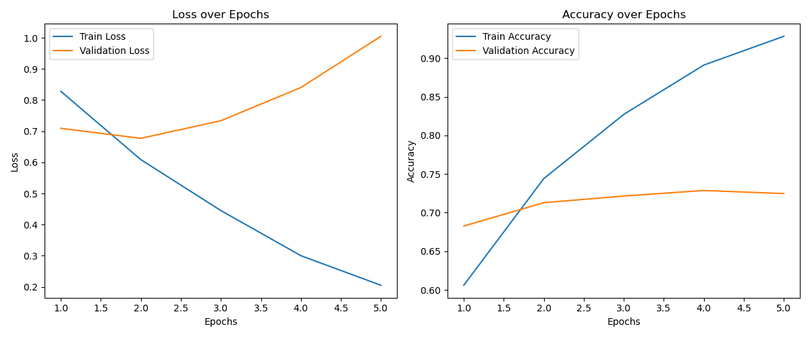
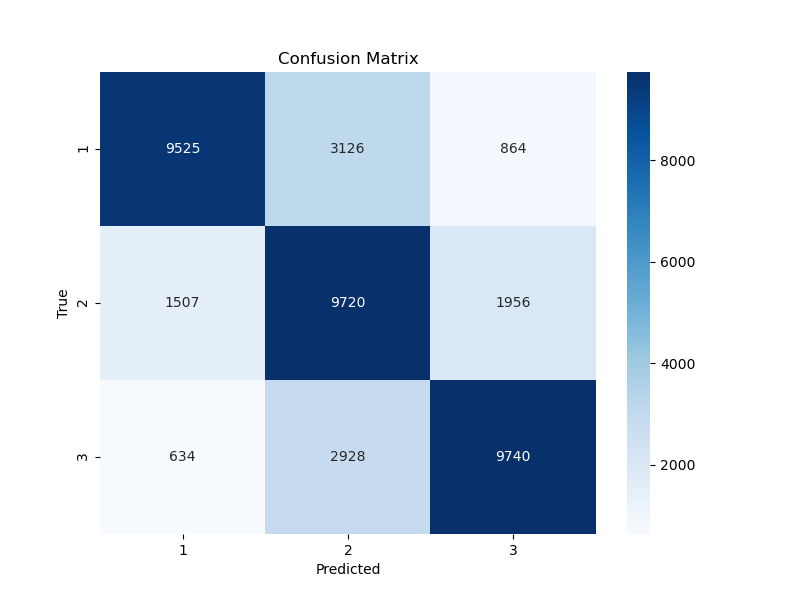
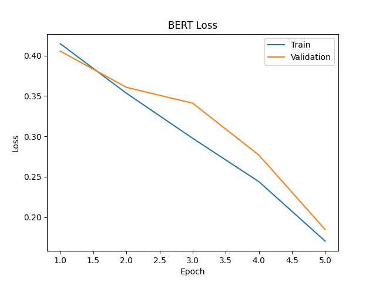
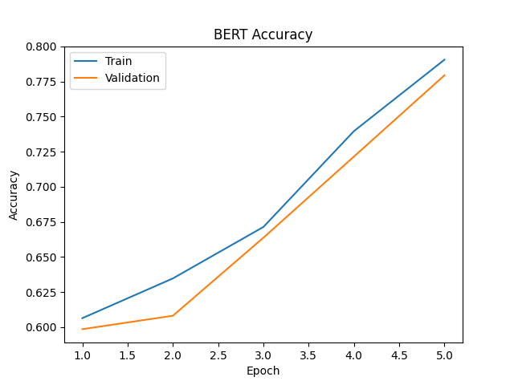
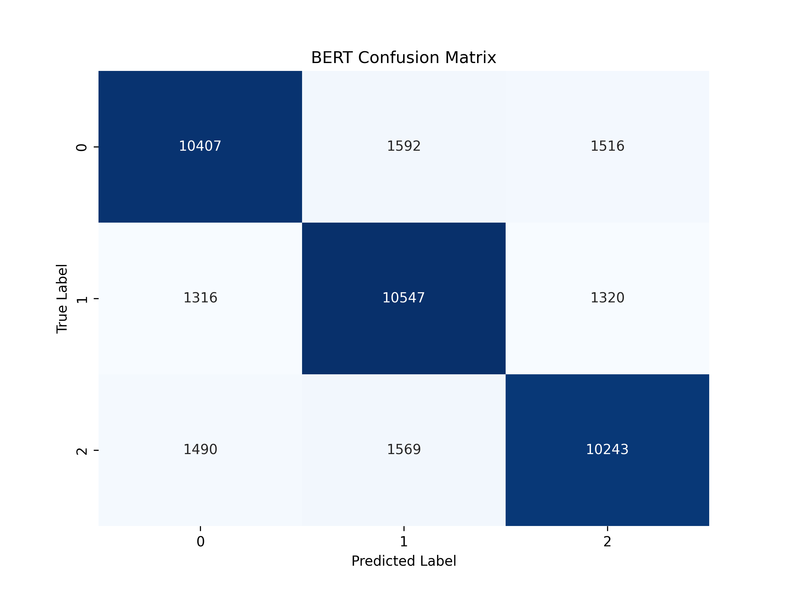

## 1.RNN

### hyperparameter tuning

| epoch | batch_size | lr       | test_acc   |
| ----- | ---------- | -------- | ---------- |
| 3     | 16         | 1e-3     | 0.5215     |
| 3     | 32         | 1e-3     | 0.4707     |
| 3     | 64         | 1e-4     | 0.5599     |
| 5     | 16         | 5e-4     | 0.4512     |
| 5     | 32         | 5e-4     | 0.5342     |
| **5** | **64**     | **1e-4** | **0.5863** |

### best model

- epoch = 5
- batch_size = 64
- lr = 1e-4
- test_acc = 0.5863

| Epoch | Train Loss | Train Accuracy | Val Loss  | Val Accuracy |
|-------|------------|----------------|-----------|--------------|
| 1     | 1.0492     | 0.4463         | 0.9737    | 0.5170       |
| 2     | 0.9628     | 0.5255         | 0.9289    | 0.5452       |
| 3     | 0.9228     | 0.5549         | 0.8996    | 0.5675       |
| 4     | 0.9130     | 0.5620         | 0.9202    | 0.5612       |
| 5     | 0.8862     | 0.5789         | 0.8716    | 0.5863       |

## 2.LSTM

### hyperparameter tuning

| epoch | batch_size | lr       | test_acc   |
| ----- | ---------- | -------- | ---------- |
| **5** | **32**     | **1e-3** | **0.7246** |
| 5     | 32         | 5e-4     | 0.7164     |
| 5     | 128        | 5e-4     | 0.7120     |
| 5     | 256        | 1e-3     | 0.6868     |
| 5     | 256        | 5e-4     | 0.6906     |

### best model

- epoch = 5
- batch_size = 32
- lr = 1e-3
- test_acc = 0.7246

| Epoch | Train Loss | Train Accuracy | Val Loss  | Val Accuracy |
|-------|------------|----------------|-----------|--------------|
| 1     | 0.8281     | 0.6059         | 0.7093    | 0.6826       |
| 2     | 0.6086     | 0.7440         | 0.6771    | 0.7128       |
| 3     | 0.4450     | 0.8272         | 0.7337    | 0.7215       |
| 4     | 0.3000     | 0.8910         | 0.8403    | 0.7286       |
| 5     | 0.2050     | 0.9283         | 1.0050    | 0.7246       |

## 3.BERT

### hyperparameter tuning

| epoch | batch_size | lr       | val_acc    |
| ----- | ---------- | -------- | ---------- |
| 3     | 16         | 2e-5     | 0.7411     |
| 3     | 16         | 3e-5     | 0.7326     |
| 3     | 32         | 2e-5     | 0.7346     |
| **5** | **16**     | **2e-5** | **0.7795** |
| 5     | 16         | 3e-5     | 0.7517     |

### best model

- epochs=5
- batch_size=16
- learning_rate=2e-05
- test_acc 0.7795

| epoch | train_loss | train_acc | val_loss | val_acc |
| ----- | ---------- | --------- | -------- | ------- |
| 1     | 0.418      | 0.6065    | 0.4056   | 0.5986  |
| 2     | 0.3534     | 0.6348    | 0.3608   | 0.6082  |
| 3     | 0.2977     | 0.6715    | 0.3411   | 0.6638  |
| 4     | 0.2440     | 0.7397    | 0.2769   | 0.7216  |
| 5     | 0.1704     | 0.9706    | 0.1847   | 0.7795  |

